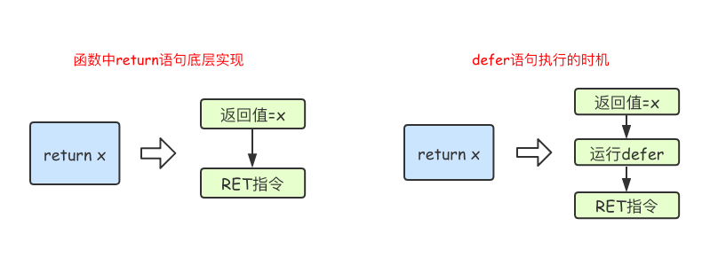

# 4.1 函数

## 函数定义

Go语言中定义函数使用func关键字，具体格式如下：
```go
func 函数名(参数)(返回值){
    函数体
}
```

+ 函数名：由字母、数字、下划线组成。但函数名的第一个字母不能是数字。在同一个包内，函数名也称不能重名（包的概念详见后文）。
+ 参数：参数由参数变量和参数变量的类型组成，多个参数之间使用,分隔。
+ 返回值：返回值由返回值变量和其变量类型组成，也可以只写返回值的类型，多个返回值必须用()包裹，并用,分隔。
+ 函数体：实现指定功能的代码块。

## 函数调用

定义了函数之后，我们可以通过`函数名()`的方式调用函数。

```go
func main() {
	sayHello()
	ret := intSum(10, 20)
	fmt.Println(ret)
}
```

注意，调用有返回值的函数时，**可以**不接收其返回值。同时，我们也可以用`匿名变量`忽略部分返回值。

## 函数的参数

### 类型简写

若参数中相邻变量类型相同，则可以省略类型。

```go
//example
func sum(x, y int) int {
    return x + y
}
```

### 可变参数

可变参数是指函数的参数数量不固定。Go语言中的可变参数通过在参数名后加`...`来标识。

```go
//example
func sum2(x ...int) int {
    fmt.Println(x)      //此时，x是切片
    sum := 0
    for _, v := range x {
        sum += v
    }
    return sum
}

//调用上面的函数
func main() {
    res1 := sum2()
    res2 := sum2(24)
    res2 := sum2(24, 114514)
    res3 := sum2(24, 114514, 1919810) 
}
```

## 返回值

Go语言中通过`return`关键字向外输出返回值。

### 多个返回值

Go语言中函数支持多返回值，函数如果有多个返回值时必须用`()`将所有返回值包裹起来。

```go
func (u *User) Authentication(ctx context.Context, username, password string) (string, error) {
	if username != "admin" || password != "admin" {
		// test account: admin admin
		err = errors.New("用户名密码错误")
		return nil, err
	}
	userID = username
	return userID, nil
}
```

### 返回值命名

函数定义时可以给返回值命名，并在函数体中直接使用这些变量，最后通过`return`关键字返回。

```go
func (u *User) Authentication(ctx context.Context, username, password string) (userID string, err error) {
	if username != "admin" || password != "admin" {
		// test account: admin admin
		err = errors.New("用户名密码错误")
		return
	}
	userID = username
	return
}
```

当返回值为切片时，`nil`可以看做是一个有效的切片，没必要显示返回一个长度为0的切片。

## 变量作用域

### 全局变量

全局变量是定义在函数外部的变量，它在程序整个运行周期内都有效。 在函数中可以访问到全局变量。

```go
//example
package main

import "fmt"

//定义全局变量num
var num int64 = 10

func testGlobalVar() {
	fmt.Printf("num=%d\n", num) //函数中可以访问全局变量num
}
func main() {
	testGlobalVar() //num=10
}
```

### 局部变量

局部变量可大致分为两种：函数内定义变量，语句块定义变量。

函数内定义的变量无法在函数外和其他函数使用。

同样，语句块内定义的变量无法在语句块外使用。通常我们会在if条件判断、for循环、switch语句上使用这种定义变量的方式。

```go
//example
func testLocalVar2(x, y int) {
	fmt.Println(x, y) //函数的参数也是只在本函数中生效
	if x > 0 {
		z := 100 //变量z只在if语句块生效
		fmt.Println(z)
	}
	//fmt.Println(z)//此处无法使用变量z
}

//还有我们之前讲过的for循环语句中定义的变量，也是只在for语句块中生效：
func testLocalVar3() {
	for i := 0; i < 10; i++ {
		fmt.Println(i) //变量i只在当前for语句块中生效
	}
	//fmt.Println(i) //此处无法使用变量i
}
```

## 函数类型变量

我们可以使用`type`关键字来定义一个函数类型，具体格式如下：

```go
type calc func(int, int) int
```
上面语句定义了一个`calc`类型，它是一种函数类型，这种函数接收两个`int`类型的参数并且返回一个`int`类型的返回值。
例如，下述函数均为`calc`类型
```go
func add(x, y int) int {
	return x + y
}

func sub(x, y int) int {
	return x - y
}

//add和sub都能赋值给calc类型的变量。
var ttt calc
ttt = add
```
可以试试下述输出。
```go
//example
func main() {
	var c calc                      // 声明一个calc类型的变量c
	c = add                         // 把add赋值给c
	fmt.Printf("type of c:%T\n", c) // type of c:main.calc
	fmt.Println(c(1, 2))            // 像调用add一样调用c

	f := add                        // 将函数add赋值给变量f
	fmt.Printf("type of f:%T\n", f) // type of f:func(int, int) int
	fmt.Println(f(10, 20))          // 像调用add一样调用f
}
```

## 高阶函数

高阶函数分为函数作为参数和函数作为返回值两部分。

### 函数作为参数

```go
//example
func add(x, y int) int {
	return x + y
}
func calc(x, y int, add func(int, int) int) int {
	return add(x, y)
}
func main() {
	res := calc(10, 20, add)
	fmt.Println(res) //30
}
```

### 函数作为返回值

```go
//example
func do(s string) (func(int, int) int, error) {
	switch s {
	case "+":
		return add, nil
	case "-":
		return sub, nil
	default:
		err := errors.New("无法识别的操作符")
		return nil, err
	}
}
```

## 匿名函数

函数当然还可以作为返回值，但是在Go语言中函数内部不能再像之前那样定义函数了，只能定义匿名函数。匿名函数就是没有函数名的函数，匿名函数的定义格式如下：
```go
func(参数)(返回值){
    函数体
}
```
匿名函数因为没有函数名，所以没办法像普通函数那样调用，所以匿名函数需要保存到某个变量或者作为立即执行函数:

```go
func main() {
	// 将匿名函数保存到变量
	add := func(x, y int) {
		fmt.Println(x + y)
	}
	add(10, 20) // 通过变量调用匿名函数

	//自执行函数：匿名函数定义完加()直接执行
	func(x, y int) {
		fmt.Println(x + y)
	}(10, 20)
}
```

匿名函数多用于实现回调函数和闭包。

## 闭包

```go
// squares返回一个匿名函数。
// 该匿名函数每次被调用时都会返回下一个数的平方。
func squares() func() int {
    var x int
    return func() int {
        x++
        return x * x
    }
}
func main() {
    f := squares()
    fmt.Println(f()) // "1"
    fmt.Println(f()) // "4"
    fmt.Println(f()) // "9"
    fmt.Println(f()) // "16"
}
```

可以看到，随着对`f`的调用增加，其内部的变量`x`也随之增加。

变量`f`是一个函数并且它引用了其外部作用域中的`x`变量，此时`f`就是一个`闭包`。 在`f`的生命周期内，变量`x`也一直有效。

## defer

Go语言中的`defer`语句会将其后面跟随的语句进行延迟处理。在`defer`归属的函数即将返回时，将延迟处理的语句按`defer`定义的逆序进行执行，也就是说，先被`defer`的语句最后被执行，最后被`defer`的语句，最先被执行。

```go
func main() {
	fmt.Println("start")
	defer fmt.Println(1)
	defer fmt.Println(2)
	defer fmt.Println(3)
	fmt.Println("end")
}
```

可以试一下上述例子的输出。
```go
// output：
start
end
3
2
1
```

我们可以看一下defer的执行时机



在Go语言的函数中`return`语句在底层并不是原子操作，它分为给返回值赋值和`RET`指令两步。而`defer`语句执行的时机就在返回值赋值操作后，`RET`指令执行前。

## 一些内置函数


|内置函数|	介绍|
|-|-|
|close|	主要用来关闭channel|
|len|	用来求长度，比如string、array、slice、map、channel|
|new|	用来分配内存，主要用来分配值类型，比如int、struct。返回的是指针|
|make|	用来分配内存，主要用来分配引用类型，比如chan、map、slice|
|append|	用来追加元素到数组、slice中|
|panic和recover|	用来做错误处理|

## panic/recover

`panic/recover`模式来处理错误。 `panic`可以在任何地方引发，但`recover`只有在`defer`调用的函数中有效。 

可以运行下下面两个例子
```go
package main

import "fmt"


func funcA() {
	fmt.Println("func A")
}

func funcB() {
	panic("panic in B")
}

func funcC() {
	fmt.Println("func C")
}
func main() {
	funcA()
	funcB()
	funcC()
}
```
还有
```go
package main

import "fmt"

func funcA() {
	fmt.Println("func A")
}

func funcB() {
	defer func() {
		err := recover()
		//如果程序出出现了panic错误,可以通过recover恢复过来
		if err != nil {
			fmt.Println("recover in B")
		}
	}()
	panic("panic in B")
}

func funcC() {
	fmt.Println("func C")
}
func main() {
	funcA()
	funcB()
	funcC()
}
```


**注意：**

+ `recover()`必须搭配`defer`使用。
+ `defer`一定要在可能引发`panic`的语句之前定义。

